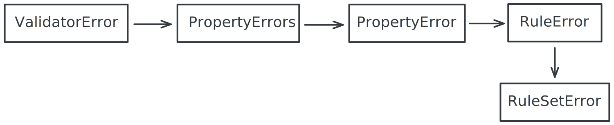

# govy

[](https://pkg.go.dev/github.com/nobl9/govy)
[](https://goreportcard.com/report/github.com/nobl9/govy)
[](https://raw.githack.com/wiki/nobl9/govy/coverage.html)

Validation library for Go that uses a functional interface for building
strongly-typed validation rules, powered by generics and
[reflection free](#reflection).
It puts heavy focus on end user errors readability,
providing means of crafting clear and information-rich error messages.
It also allows writing self-documenting validation rules through a
[validation plan](#validation-plan).

**GO** **V**alidate **Y**ourself!

**DISCLAIMER**: govy is in active development, while the core API is unlikely
to change, breaking changes may be introduced with new versions until v1
is released.
Checkout [roadmap](https://github.com/orgs/nobl9/projects/5/views/2?pane=info)
for upcoming, planned features.

## Legend

1. [Getting started](#getting-started)
    1. [Use cases](#use-cases)
    2. [Comparison with other libraries](#comparison-with-other-libraries)
2. [Building blocks](#building-blocks)
    1. [Errors](#errors)
3. [Features](#features)
    1. [Type safety](#type-safety)
    2. [Immutability](#immutability)
    3. [Verbose error messages](#verbose-error-messages)
    4. [Error message templates](#error-message-templates)
    5. [Error message templates in custom rules](#error-message-templates-in-custom-rules)
    6. [Predefined rules](#predefined-rules)
    7. [Custom rules](#custom-rules)
    8. [Validation plan](#validation-plan)
    9. [Properties name inference](#properties-name-inference)
    10. [Testing helpers](#testing-helpers)
4. [Rationale](#rationale)
    1. [Reflection](#reflection)
    2. [Trivia](#trivia)
5. [Development](#development)
    1. [Tests coverage](#tests-coverage)
    2. [Benchmarks](#benchmarks)
6. [Acknowledgments](#acknowledgments)

## Getting started

In order to add the library to your project, run:

```shell
go get github.com/nobl9/govy
```

There's an interactive tutorial available,
powered by Go's [testable examples](https://go.dev/blog/examples),
to access it visit [pkg.go.dev](https://pkg.go.dev/github.com/nobl9/govy)
or locally at [example_test.go](./pkg/govy/example_test.go).

Govy's code documentation is available at
[pkg.go.dev](https://pkg.go.dev/github.com/nobl9/govy).

You can read
[this blog post](https://www.nobl9.com/resources/type-safe-validation-in-go-with-govy)
for a quick overview of the library, its capabilities,
what distinguishes it from other solutions and why was it conceived.

Here's a quick example of `govy` in action:

[//]: # (embed: internal/examples/readme_intro_example_test.go)

```go
package examples

import (
	"fmt"
	"regexp"
	"time"

	"github.com/nobl9/govy/pkg/govy"
	"github.com/nobl9/govy/pkg/rules"
)

func Example_basicUsage() {
	type University struct {
		Name    string `json:"name"`
		Address string `json:"address"`
	}
	type Student struct {
		Index string `json:"index"`
	}
	type Teacher struct {
		Name       string        `json:"name"`
		Age        time.Duration `json:"age"`
		Students   []Student     `json:"students"`
		MiddleName *string       `json:"middleName,omitempty"`
		University University    `json:"university"`
	}

	universityValidation := govy.New(
		govy.For(func(u University) string { return u.Name }).
			WithName("name").
			Required(),
		govy.For(func(u University) string { return u.Address }).
			WithName("address").
			Required().
			Rules(rules.StringMatchRegexp(
				regexp.MustCompile(`[\w\s.]+, [0-9]{2}-[0-9]{3} \w+`),
			).
				WithDetails("Polish address format must consist of the main address and zip code").
				WithExamples("5 M. Skłodowska-Curie Square, 60-965 Poznan")),
	)
	studentValidator := govy.New(
		govy.For(func(s Student) string { return s.Index }).
			WithName("index").
			Rules(rules.StringLength(9, 9)),
	)
	teacherValidator := govy.New(
		govy.For(func(t Teacher) string { return t.Name }).
			WithName("name").
			Required().
			Rules(
				rules.StringNotEmpty(),
				rules.OneOf("Jake", "George")),
		govy.ForPointer(func(t Teacher) *string { return t.MiddleName }).
			WithName("middleName").
			Rules(rules.StringTitle()),
		govy.ForSlice(func(t Teacher) []Student { return t.Students }).
			WithName("students").
			Rules(
				rules.SliceMaxLength[[]Student](2),
				rules.SliceUnique(func(v Student) string { return v.Index })).
			IncludeForEach(studentValidator),
		govy.For(func(t Teacher) University { return t.University }).
			WithName("university").
			Include(universityValidation),
	).
		When(func(t Teacher) bool { return t.Age < 50 })

	teacher := Teacher{
		Name:       "John",
		MiddleName: nil, // Validation for nil pointers by default is skipped.
		Age:        48,
		Students: []Student{
			{Index: "918230014"},
			{Index: "9182300123"},
			{Index: "918230014"},
		},
		University: University{
			Name:    "",
			Address: "10th University St.",
		},
	}

	if err := teacherValidator.WithName("John").Validate(teacher); err != nil {
		fmt.Println(err)
	}
	// When condition is not met, no validation errors.
	johnFromTheFuture := teacher
	johnFromTheFuture.Age = 51
	if err := teacherValidator.WithName("John From The Future").Validate(johnFromTheFuture); err != nil {
		fmt.Println(err)
	}

	// Output:
	// Validation for John has failed for the following properties:
	//   - 'name' with value 'John':
	//     - must be one of: Jake, George
	//   - 'students' with value '[{"index":"918230014"},{"index":"9182300123"},{"index":"918230014"}]':
	//     - length must be less than or equal to 2
	//     - elements are not unique, 1st and 3rd elements collide
	//   - 'students[1].index' with value '9182300123':
	//     - length must be between 9 and 9
	//   - 'university.name':
	//     - property is required but was empty
	//   - 'university.address' with value '10th University St.':
	//     - string must match regular expression: '[\w\s.]+, [0-9]{2}-[0-9]{3} \w+' (e.g. '5 M. Skłodowska-Curie Square, 60-965 Poznan'); Polish address format must consist of the main address and zip code
}
```

### Use cases

1. [Nobl9 Go SDK](https://github.com/nobl9/nobl9-go) \
   This is where `govy` was born,
   it's used for validating complex k8s-like schema, it contains both simple
   and very advanced validation rules and is a great place to draw some
   inspiration from.
2. [OpenSLO](https://github.com/OpenSLO/OpenSLO) \
   It's used for validating open specification for defining SLOs.
   The specification is a complex, YAML-based and k8s compatible schema,
   similar to Nobl9's configuration.

### Comparison with other libraries

1. [go-playground/validator](https://github.com/go-playground/validator) \
   Visit [runnable example](./docs/validator-comparison/example_test.go) for a
   comprehensive, live code comparison between `govy` and
   `go-playground/validator`.
   `validator` was the predecessor which `govy` dethroned at Nobl9.
   For more trivia and details on the differences between the two,
   check out the [rationale](#rationale) section.

## Building blocks

Govy validation flow consists of the following building blocks:


1. `Validator` is the top-level entity which usually
   aggregates `PropertyRules` for a single struct.
2. `PropertyRules` is a representation of a single property's validation rules.
   It usually represents a single struct field.
   It comes with two extra variants specifically designed for slices and maps.
   These allow defining rules for each element, key or value of the property.
3. `Rule` defines a single validation rule.
   Multiple rules can be combined to form a more complex
   validation rule using RuleSet.

### Errors

Govy errors are structured (as in each is a struct) and reflect the
aforementioned building blocks hierarchy:



The exception being `PropertyErrors` which is an additional container for
grouping `PropertyError` without the context of a specific `Validator`.

Govy functions return `error` interface.
In order to access the underlying structured error, you need to type cast it.
The reason for that is the interface type implementation in Go.
If, hypothetically, `Validator` would return `*ValidatorError` directly,
and given the following code in this
[GitHub gist](https://gist.github.com/nieomylnieja/268841b12571e8bb3a01780e8e6663c5),
the nil assertions on produced `error` would fail.
More details available in the
[laws of reflection blog post](https://go.dev/blog/laws-of-reflection#TOC_3.).

## Features

### Type safety

Govy is built on top of [Go's generics](https://go.dev/doc/tutorial/generics).
Thanks to that it is able to provide a robust and extensible API which is still
type-safe.

### Immutability

Govy components are largely immutable and lazily loaded:

- Immutable, as changing the pipeline through chained functions,
  will return a new pipeline.
  It allows extended reusability of validation components.
- Lazily loaded, as properties are extracted through getter functions,
  which are only called when you call the `Validate` method.
  Functional approach allows validation components to only be called when
  needed.
  You should define your pipeline once and call it
  whenever you validate instances of your entity.

### Verbose error messages

Default `govy` error messages are verbose and provide a clear indication both
of the error cause and the property context in which they occurred.

The property paths are evaluated relative to the root `Validator` and follow
[JSON path](https://datatracker.ietf.org/doc/html/rfc9535) standard.

```text
Validation for Teacher has failed for the following properties:
  - 'name' with value 'John':
    - must be one of [Jake, George]
  - 'students' with value '[{"index":"918230014"},{"index":"9182300123"},{"index":"918230014"}]':
    - length must be less than or equal to 2
    - elements are not unique, index 0 collides with index 2
  - 'students[1].index' with value '9182300123':
    - length must be between 9 and 9
  - 'university.address':
    - property is required but was empty
```

The errors themselves are structured and can be parsed programmatically
allowing custom error handling.
They come with exported fields, JSON tags and can be easily serialized and
deserialized.

#### Error message templates

If you want a more fine-grained control over the error messages,
you can define custom error message templates for each builtin rule.

The templates are powered by [Go's native templating system](https://pkg.go.dev/text/template).
Each builtin validation rule has specific variables available
and there are also builtin functions shipped which help construct
the message templates (like _formatExamples_ in the example below).

[//]: # (embed: internal/examples/readme_message_templates_example_test.go)

```go
package examples

import (
	"fmt"

	"github.com/nobl9/govy/pkg/govy"
	"github.com/nobl9/govy/pkg/rules"
)

func Example_messageTemplates() {
	type Teacher struct {
		Name string `json:"name"`
	}

	templateString := "name length should be between {{ .MinLength }} and {{ .MaxLength }} {{ formatExamples .Examples }}"

	v := govy.New(
		govy.For(func(t Teacher) string { return t.Name }).
			WithName("name").
			Rules(
				rules.StringLength(5, 10).
					WithExamples("Joanna", "Jerry").
					WithMessageTemplateString(templateString),
			),
	).WithName("Teacher")

	teacher := Teacher{Name: "Tom"}
	err := v.Validate(teacher)
	if err != nil {
		fmt.Println(err)
	}

	// Output:
	// Validation for Teacher has failed for the following properties:
	//   - 'name' with value 'Tom':
	//     - name length should be between 5 and 10 (e.g. 'Joanna', 'Jerry')
}
```

#### Error message templates in custom rules

If you wish to support templating in your custom rules, you need to make sure
your rules ALWAYS return `govy.RuleErrorTemplate` and supply the template
with either `govy.Rule.WithMessageTemplateString` or `govy.Rule.WithMessageTemplate`.

[//]: # (embed: internal/examples/readme_adding_message_templates_support_example_test.go)

```go
package examples

import (
	"fmt"

	"github.com/nobl9/govy/pkg/govy"
	"github.com/nobl9/govy/pkg/rules"
)

func Example_addingMessageTemplatesSupportToCustomRules() {
	type Teacher struct {
		Name string `json:"name"`
	}

	template := `{{ .PropertyValue }} must be {{ .ComparisonValue }}; {{ .Custom.Foo }} and {{ .Custom.Baz }}`

	customRule := govy.NewRule(func(name string) error {
		if name != "John" {
			return govy.NewRuleErrorTemplate(govy.TemplateVars{
				PropertyValue:   name,
				ComparisonValue: "John",
				Custom: map[string]any{
					"Foo": "Bar",
					"Baz": 42,
				},
			})
		}
		return nil
	}).
		WithErrorCode("custom_rule").
		WithMessageTemplateString(template).
		WithDetails("we just don't like anyone but Johns...").
		WithDescription("must be John")

	teacherValidator := govy.New(
		govy.For(func(t Teacher) string { return t.Name }).
			WithName("name").
			Required().
			Rules(
				customRule,
				rules.StringStartsWith("J"),
			),
	).InferName()

	teacher := Teacher{Name: "George"}

	if err := teacherValidator.Validate(teacher); err != nil {
		fmt.Println(err)
	}

	// Output:
	// Validation for Teacher has failed for the following properties:
	//   - 'name' with value 'George':
	//     - George must be John; Bar and 42
	//     - string must start with 'J' prefix
}
```

### Predefined rules

Govy comes with a set of predefined rules defined
in the [rules](./pkg/rules) package which covers most of the common use cases.

#### Custom rules

If the predefined rules are not enough, you can easily define your own rules:

[//]: # (embed: internal/examples/readme_custom_rule_example_test.go)

```go
package examples

import (
	"fmt"

	"github.com/nobl9/govy/pkg/govy"
	"github.com/nobl9/govy/pkg/rules"
)

func Example_customRules() {
	type Teacher struct {
		Name string `json:"name"`
	}

	customRule := govy.NewRule(func(name string) error {
		if name != "John" {
			return fmt.Errorf("must be John")
		}
		return nil
	}).
		WithErrorCode("custom_rule").
		WithDetails("we just don't like anyone but Johns...").
		WithDescription("must be John")

	teacherValidator := govy.New(
		govy.For(func(t Teacher) string { return t.Name }).
			WithName("name").
			Required().
			Rules(
				customRule,
				rules.StringStartsWith("J")),
	).InferName()

	teacher := Teacher{Name: "George"}

	if err := teacherValidator.Validate(teacher); err != nil {
		fmt.Println(err)
	}

	// Output:
	// Validation for Teacher has failed for the following properties:
	//   - 'name' with value 'George':
	//     - must be John; we just don't like anyone but Johns...
	//     - string must start with 'J' prefix
}
```

### Validation plan

_DISCLAIMER_: This feature is experimental and is subject to change.

Validation plan provides a way to self-document your validation rules.
It helps keep your documentation and validation rules in sync.
It produces a structured output which can be handled programmatically
or directly encoded to JSON.

[//]: # (embed: internal/examples/readme_validation_plan_example_test.go)

```go
package examples

import (
	"encoding/json"
	"os"
	"regexp"
	"time"

	"github.com/nobl9/govy/pkg/govy"
	"github.com/nobl9/govy/pkg/rules"
)

func Example_validationPlan() {
	type University struct {
		Name    string `json:"name"`
		Address string `json:"address"`
	}
	type Student struct {
		Index string `json:"index"`
	}
	type Teacher struct {
		Name       string        `json:"name"`
		Age        time.Duration `json:"age"`
		Students   []Student     `json:"students"`
		MiddleName *string       `json:"middleName,omitempty"`
		University University    `json:"university"`
	}

	universityValidation := govy.New(
		govy.For(func(u University) string { return u.Name }).
			WithName("name").
			Required(),
		govy.For(func(u University) string { return u.Address }).
			WithName("address").
			Required().
			Rules(rules.StringMatchRegexp(
				regexp.MustCompile(`[\w\s.]+, [0-9]{2}-[0-9]{3} \w+`),
			).
				WithDetails("Polish address format must consist of the main address and zip code").
				WithExamples("5 M. Skłodowska-Curie Square, 60-965 Poznan")).
			When(func(u University) bool { return u.Name == "PUT" },
				govy.WhenDescription("University name is PUT University")),
	)
	studentValidator := govy.New(
		govy.For(func(s Student) string { return s.Index }).
			WithName("index").
			Rules(rules.StringLength(9, 9)),
	)
	teacherValidator := govy.New(
		govy.For(func(t Teacher) string { return t.Name }).
			WithName("name").
			Required().
			Rules(
				rules.StringNotEmpty(),
				rules.OneOf("Jake", "George")),
		govy.ForPointer(func(t Teacher) *string { return t.MiddleName }).
			WithName("middleName").
			Rules(rules.StringTitle()),
		govy.ForSlice(func(t Teacher) []Student { return t.Students }).
			WithName("students").
			Rules(
				rules.SliceMaxLength[[]Student](2),
				rules.SliceUnique(func(v Student) string { return v.Index })).
			IncludeForEach(studentValidator),
		govy.For(func(t Teacher) University { return t.University }).
			WithName("university").
			Include(universityValidation).
			When(func(t Teacher) bool { return t.Name == "John" },
				govy.WhenDescription("Teacher name is John")),
	).
		WithName("Teacher")

	plan := govy.Plan(teacherValidator)
	enc := json.NewEncoder(os.Stdout)
	enc.SetIndent("", "  ")
	_ = enc.Encode(plan)

	// Output:
	// {
	//   "name": "Teacher",
	//   "properties": [
	//     {
	//       "path": "$.middleName",
	//       "typeInfo": {
	//         "name": "string",
	//         "kind": "string"
	//       },
	//       "isOptional": true,
	//       "rules": [
	//         {
	//           "description": "each word in a string must start with a capital letter",
	//           "errorCode": "string_title"
	//         }
	//       ]
	//     },
	//     {
	//       "path": "$.name",
	//       "typeInfo": {
	//         "name": "string",
	//         "kind": "string"
	//       },
	//       "values": [
	//         "Jake",
	//         "George"
	//       ],
	//       "rules": [
	//         {
	//           "description": "string cannot be empty",
	//           "errorCode": "string_not_empty"
	//         },
	//         {
	//           "description": "must be one of: Jake, George",
	//           "errorCode": "one_of"
	//         }
	//       ]
	//     },
	//     {
	//       "path": "$.students",
	//       "typeInfo": {
	//         "name": "[]Student",
	//         "kind": "[]struct",
	//         "package": "github.com/nobl9/govy/internal/examples"
	//       },
	//       "rules": [
	//         {
	//           "description": "length must be less than or equal to 2",
	//           "errorCode": "slice_max_length"
	//         },
	//         {
	//           "description": "elements must be unique",
	//           "errorCode": "slice_unique"
	//         }
	//       ]
	//     },
	//     {
	//       "path": "$.students[*].index",
	//       "typeInfo": {
	//         "name": "string",
	//         "kind": "string"
	//       },
	//       "rules": [
	//         {
	//           "description": "length must be between 9 and 9",
	//           "errorCode": "string_length"
	//         }
	//       ]
	//     },
	//     {
	//       "path": "$.university.address",
	//       "typeInfo": {
	//         "name": "string",
	//         "kind": "string"
	//       },
	//       "rules": [
	//         {
	//           "description": "string must match regular expression: '[\\w\\s.]+, [0-9]{2}-[0-9]{3} \\w+'",
	//           "details": "Polish address format must consist of the main address and zip code",
	//           "errorCode": "string_match_regexp",
	//           "conditions": [
	//             "Teacher name is John",
	//             "University name is PUT University"
	//           ],
	//           "examples": [
	//             "5 M. Skłodowska-Curie Square, 60-965 Poznan"
	//           ]
	//         }
	//       ]
	//     },
	//     {
	//       "path": "$.university.name",
	//       "typeInfo": {
	//         "name": "string",
	//         "kind": "string"
	//       },
	//       "rules": [
	//         {
	//           "description": "",
	//           "conditions": [
	//             "Teacher name is John"
	//           ]
	//         }
	//       ]
	//     }
	//   ]
	// }
}
```

### Properties name inference

_DISCLAIMER_: This feature is experimental and is subject to change.

Govy provides a way to automatically infer property names from the code itself.
This way, there's no need to manually provide properties' names with
`WithName` function.

Checkout [example_test.go](./pkg/govyconfig/example_test.go) for an interactive
introduction to this feature.

Documentation for the name inference code generator is available
[here](cmd/govy/README.md#nameinfer).

[//]: # (embed: internal/examples/readme_name_inference_example_test.go)

```go
package examples

import (
	"fmt"

	"github.com/nobl9/govy/pkg/govy"
	"github.com/nobl9/govy/pkg/govyconfig"
	"github.com/nobl9/govy/pkg/rules"
)

func Example_nameInference() {
	govyconfig.SetNameInferIncludeTestFiles(true) // Required for the example to run.
	govyconfig.SetNameInferMode(govyconfig.NameInferModeRuntime)
	defer govyconfig.SetNameInferIncludeTestFiles(false)
	defer govyconfig.SetNameInferMode(govyconfig.NameInferModeDisable)

	type Teacher struct {
		Name string `json:"name"`
	}

	v := govy.New(
		govy.For(func(t Teacher) string { return t.Name }).
			Rules(rules.EQ("Jerry")),
	).InferName()

	teacher := Teacher{Name: "Tom"}
	err := v.Validate(teacher)
	if err != nil {
		fmt.Println(err)
	}

	// Output:
	// Validation for Teacher has failed for the following properties:
	//   - 'name' with value 'Tom':
	//     - should be equal to 'Jerry'
}
```

### Testing helpers

Package [govytest](./pkg/govytest/) provides utilities which aid the process of
writing unit tests for validation rules defined with govy.
Checkout [testable examples](https://pkg.go.dev/github.com/nobl9/govy/pkg/govytest#pkg-examples)
for a concise overview of the package's capabilities.

## Rationale

Why was this library created?

Most of the established Go libraries for validation were created
in a pre-generics era. They often use reflection in order to provide
generic validation API, it also allows them to utilize struct tags, which
further minimize the amount of code users need to write.

Unfortunately, the ease of use compromises Go's core language feature,
type safety and increases the complexity of the code.

Enter, generics.
With generics on board, it's finally possible to write a robust and type safe
validation API, thus `govy` was born.

### Reflection

Is `govy` truly reflection free?

The short answer is yes, the long answer is `govy` does not utilize
reflection other than to serve better error messages or devise a
[validation plan](#validation-plan).
Some builtin rules might also use `reflect`, but the core functionality
does not rely on it.

### Trivia

The library was first conceived at
[nobl9-go](https://github.com/nobl9/nobl9-go),
which is [Nobl9's](https://www.nobl9.com/) Go SDK.
It was born out of a need for a better validation mechanism,
which would also allow us to auto-document validation rules.
At the time, we were using _go-playground/validator_,
while it's a great, matured library,
it is quiet "magical" as it operates entirely on reflection.
It's default errors are also not very informative.
Furthermore, our validation rules were quiet complex and figuring out which rules
were associated with given property was tedious to say the least.
Around the same time, Go 1.18 was released with generics support, we started playing
with them, and the idea for `govy` was born.

## Development

Checkout both [contributing guidelines](./docs/CONTRIBUTING.md) and
[development instructions](./docs/DEVELOPMENT.md).

### Tests coverage

Tests coverage HTML for current `main` branch state can be inspected
[here](https://raw.githack.com/wiki/nobl9/govy/coverage.html).

Note that `cmd` package is tested by building and running Go binaries directly.
This means there won't be any coverage for some of the core functions there.

### Benchmarks

Benchmarks' history is collected and can be viewed as charts over time
[here](https://nobl9.github.io/govy/dev/bench/).

## Acknowledgments

The API along with the accompanying nomenclature was heavily inspired by the
awesome [Fluent Validation](https://github.com/FluentValidation/FluentValidation)
library for C#.

Special thanks to [go-playground/validator](https://github.com/go-playground/validator)
for paving the way for Go validation libraries,
many predefined rules have been ported from it.

---

Handcrafted with ❤️ at [Nobl9](https://www.nobl9.com/).
